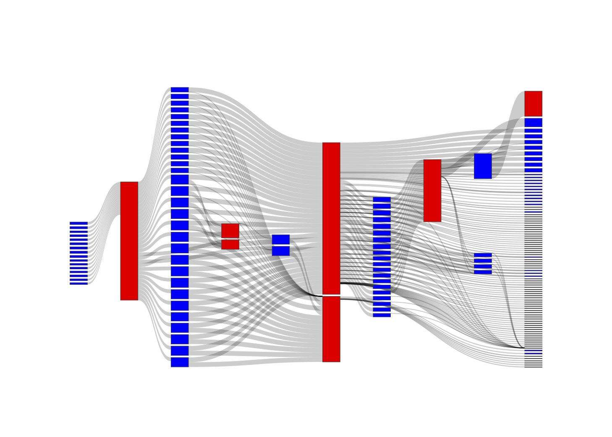
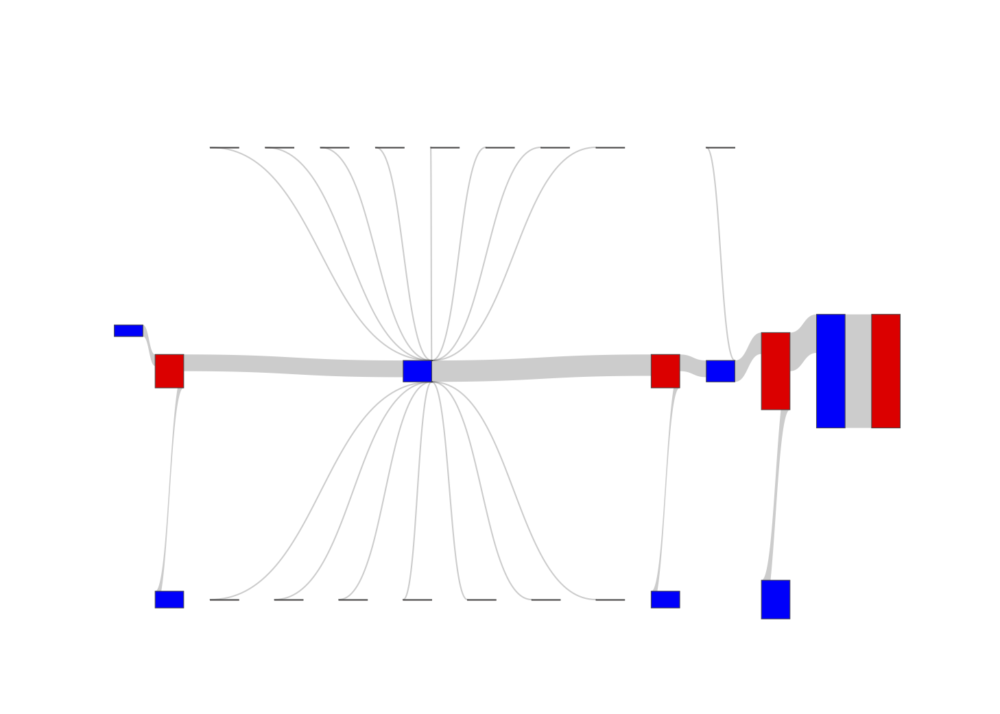

# Datalife API Quick Guide

This page introduces Data Life analysis API calls in the following order:

- reading stat files
- drawing data lifecycle graph using Sankey 
- identifying caterpillar tree

## Reading Posix I/O stat files from Tazer

You can start reading stat files to build Data Lifecycles. For example, the example below shows to read stat files by providing a directory name in `read_stats()` method.

```
from datalife import DataLife

dlife = DataLife('montage')
dlife.read_stats('./tazer_stat/montage')
```

Once all files are loaded, you can see a quick summary of statistics.

```
dlife.get_stat_summary()

number of workflow tasks	8
number of input output files	279
io size in read (byte)	78297911898
io size in write (byte)	61006266251
```
This example of the `montage` workflow shows 8 tasks associated with 279 files in reading (78GB approx.) and writing (61GB).

## Visualizing Data Lifecycle Graph in Sankey

With Sankey, we capture data flows with task executions, and the way of visualizing it is available through the `SankeyData` class.

```
sd = SankeyData()
sd.load_stat_all(dlife.get_df_all())
sd.build_links()
sd.plot()
```



## Identifying Caterpillar Tree

With a caterpillar tree, Data Lifecycles shows  a critical path with one degree of fan-in and out tasks which helps reducing the complexity of data analysis and scheduling.



